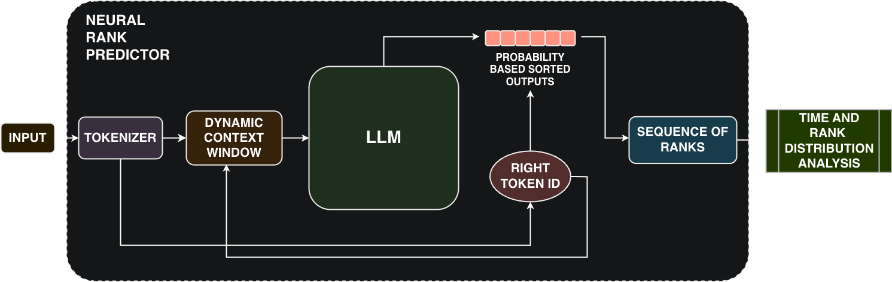

# TestModels

This directory contains the code for the **first phase of the experiments**.  
In this stage, a **simplified compression pipeline** was adopted: the process only computes the list of ranks without applying the final compression step.  
The focus of this phase is to measure:

- the **inference time** of Large Language Models (LLMs), and  
- the **distribution of ranks**,  
as preliminary indicators of the models' potential compression capabilities.  

---

## Pipeline

The simplified pipeline used in this phase is illustrated below:

---

## Models Tested

During these experiments, **30 models** were explored (see the [main README](../../README.md) for the complete table).  
Each script in this directory corresponds to one model, or to multiple variants of the same model family (e.g., different quantizations or parameter sizes).  

> ⚠️ **Important:**  
> - Some scripts may require a valid [HuggingFace](https://huggingface.co/) login to access models with restricted availability.  
> - For the file `UnixCoder.py`, it is necessary to clone the `unixcoder.py` script into your local repository. This can be obtained directly from the [Microsoft UnixCoder page](https://huggingface.co/microsoft/unixcoder-base).  

---

## Results

The analysis of results obtained in this phase (rank distributions and inference time comparisons) is available in the [RankAnalysis](../RankAnalysis) folder.  

---

## Notes

This phase serves as an **exploratory benchmark** across all available models.  
Only the most promising models identified here were selected for the **second phase of experiments**, where full compression pipelines and per-language datasets were used.
