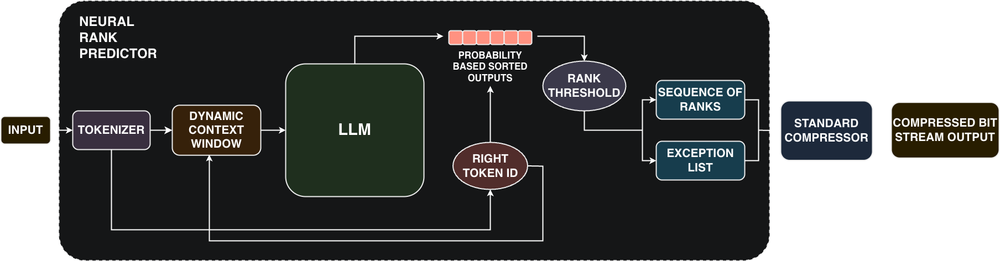

# Lossless Compression using LLMs

  
  
  
  
  
  
  

**Status:** Work in Progress 🚧  
This repository is under active development. The current codebase is incomplete, and new modules are being progressively added.  

---

## Overview

This repository explores **lossless data compression using Large Language Models (LLMs)**.  
The primary objective is to investigate novel compression techniques that aim to improve the **compression ratio** while maintaining a **throughput comparable to classical compressors**.

The research focuses exclusively on **source code compression**, as the project is conducted within the context of **[Software Heritage](https://www.softwareheritage.org/)**.  

---

## Compression Pipelines

This work introduces novel **lossless compression pipelines** that integrate Large Language Models into the traditional compression workflow. The pipelines are designed to improve the **compression ratio** while keeping **throughput close to that of classical compressors**.

Below is a schematic representation of the two pipelines:

---

## Datasets

The source code datasets used in this study were collected from Software Heritage archives via the `boto` libraries, covering six widely-used programming languages:

- **C**
- **C#**
- **C++**
- **Python**
- **Java**
- **JavaScript**

Two phases of dataset preparation were performed:

### Phase 1 – Exploratory Dataset
A smaller exploratory dataset was first curated to allow broad experimentation with a large number of models.

| Language   | # Files | Total Size (B) | Total Size (MB) | Avg Size (B) |
|------------|---------|----------------|-----------------|--------------|
| C#         | 3,407   | 10,485,193     | 10.00           | 3,077.54     |
| Python     | 3,893   | 10,484,445     | 10.00           | 2,693.15     |
| Java       | 3,436   | 10,484,007     | 10.00           | 3,051.22     |
| C          | 3,941   | 10,479,511     | 9.99            | 2,659.10     |
| C++        | 4,059   | 10,464,180     | 9.98            | 2,578.02     |
| JavaScript | 4,010   | 10,453,595     | 9.97            | 2,606.88     |
| **Total**  | 23,746  | 62,850,931     | 59.94           | --           |

---

### Phase 2 – Per-Language Datasets
After selecting the most promising models, six larger datasets were built, one for each programming language.

| Language   | # Files | Total Size (B) | Total Size (MB) | Avg Size (B) |
|------------|---------|----------------|-----------------|--------------|
| Java       | 34,401  | 104,856,598    | 100.00          | 3,048.07     |
| C#         | 33,853  | 104,856,129    | 100.00          | 3,097.40     |
| Python     | 38,312  | 104,853,756    | 100.00          | 2,736.84     |
| JavaScript | 38,988  | 104,848,652    | 99.99           | 2,689.25     |
| C++        | 35,565  | 104,848,494    | 99.99           | 2,948.08     |
| C          | 38,716  | 104,844,579    | 99.99           | 2,708.04     |
| **Total**  | 219,835 | 629,108,208    | 599.97          | --           |

---

## Models

A total of **30 LLMs** were explored, including:

- **Code-specialized models** (e.g., *StarCoder2, CodeGemma, Granite Code, CodeT5*)  
- **Quantized models** (4-bit and 8-bit versions for efficiency)  
- **General-purpose models** (*Llama 3, Mistral, GPT-2*)  

All models were retrieved from [HuggingFace](https://huggingface.co/).  

| Model name / Released by | Params | Memory | Quantized | Code-specialized | Reference |
|---------------------------|--------|--------|-----------|------------------|-----------|
| bigcode/starcoder2-3b (4bit) | 3B | 1.99 GB | Yes | Yes | [BigCode](https://huggingface.co/bigcode) |
| bigcode/starcoder2-3b (8bit) | 3B | 3.43 GB | Yes | Yes | [BigCode](https://huggingface.co/bigcode) |
| bigcode/starcoder2-3b (bfloat16) | 3B | 6.31 GB | No | Yes | [BigCode](https://huggingface.co/bigcode) |
| bigcode/starcoder2-3b (float32) | 3B | 12.62 GB | No | Yes | [BigCode](https://huggingface.co/bigcode) |
| deepseek-ai/deepseek-coder-1.3b-base | 1.3B | 2.6 GB | No | Yes | [DeepSeek](https://huggingface.co/deepseek-ai) |
| TheBloke/deepseek-coder-1.3b-base-AWQ | 1.3B | 0.85 GB | Yes | Yes | [TheBloke](https://huggingface.co/TheBloke) |
| google/codegemma-2b | 2.5B | 4.7 GB | No | Yes | [Google](https://huggingface.co/google) |
| PrunaAI/codegemma-2b-AWQ-4bit | 2.5B | 3 GB | Yes | Yes | [PrunaAI](https://huggingface.co/PrunaAI) |
| google/gemma-2-2b | 2.6B | 5.2 GB | No | No | [Google](https://huggingface.co/google) |
| unsloth/gemma-2-2b-bnb-4bit | 2.6B | 2.1 GB | Yes | No | [Unsloth](https://huggingface.co/unsloth) |
| HuggingFaceTB/SmolLM3-3B | 3B | 4.7 GB | No | No | [HuggingFaceTB](https://huggingface.co/HuggingFaceTB) |
| ibm-granite/granite-3.3-2b-base | 2B | 4.7 GB | No | No | [IBM](https://huggingface.co/ibm-granite) |
| ibm-granite/granite-3b-code-base-2k | 3B | 6.6 GB | No | Yes | [IBM](https://huggingface.co/ibm-granite) |
| PrunaAI/ibm-granite-3b-code-base-4bit | 3B | 2 GB | Yes | Yes | [PrunaAI](https://huggingface.co/PrunaAI) |
| microsoft/phi-2 | 2.7B | 4.7 GB | No | No | [Microsoft](https://huggingface.co/microsoft) |
| microsoft/unixcoder-base | 0.13B | 0.48 GB | No | Yes | [Microsoft](https://huggingface.co/microsoft) |
| mistralai/Mistral-7B-v0.3 | 7B | 14 GB | No | No | [Mistral](https://huggingface.co/mistralai) |
| unsloth/mistral-7b-v0.3-bnb-4bit | 7B | 4 GB | Yes | No | [Unsloth](https://huggingface.co/unsloth) |
| meta-llama/Llama-3.1-8B | 8B | 15 GB | No | No | [Meta](https://huggingface.co/meta-llama) |
| unsloth/Meta-Llama-3.1-8B-bnb-4bit | 8B | 5.4 GB | Yes | No | [Unsloth](https://huggingface.co/unsloth) |
| meta-llama/Llama-3.2-3B | 3.21B | 6.4 GB | No | No | [Meta](https://huggingface.co/meta-llama) |
| meta-llama/Llama-3.2-1B | 1.23B | 2.5 GB | No | No | [Meta](https://huggingface.co/meta-llama) |
| unsloth/Llama-3.2-3B-bnb-4bit | 3.21B | 2.2 GB | Yes | No | [Unsloth](https://huggingface.co/unsloth) |
| unsloth/Llama-3.2-1B-bnb-4bit | 1.23B | 0.97 GB | Yes | No | [Unsloth](https://huggingface.co/unsloth) |
| Qwen/Qwen3-1.7B | 1.7B | 3.3 GB | No | No | [Qwen](https://huggingface.co/Qwen) |
| openai/GPT-2-small | 0.124B | 0.48 GB | No | No | [OpenAI](https://huggingface.co/openai) |
| openai/GPT-2-medium | 0.355B | 1.35 GB | No | No | [OpenAI](https://huggingface.co/openai) |
| openai/GPT-2-large | 0.774B | 2.95 GB | No | No | [OpenAI](https://huggingface.co/openai) |
| openai/GPT-2-xl | 1.5B | 5.6 GB | No | No | [OpenAI](https://huggingface.co/openai) |
| Salesforce/codet5-base | 0.22B | 0.85 GB | No | Yes | [Salesforce](https://huggingface.co/Salesforce) |

---

## Baseline Compressors

For benchmarking purposes, standard lossless compression algorithms were used as baselines:

- [**bzip2**](http://www.bzip.org/)  
- [**bzip3**](https://github.com/kspalaiologos/bzip3)  
- [**zstd**](https://facebook.github.io/zstd/)  

These compressors provide reference points in terms of both **compression ratio** and **throughput**.   

---

## Citation

If you use this repository or the associated datasets in your research, please cite the corresponding work (citation details will be provided soon).  

